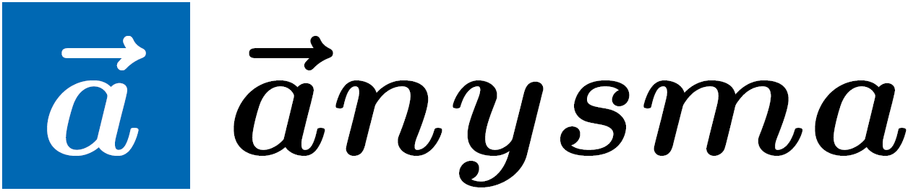

# anysma: easy definition of tensor flow based neural networks



[](https://github.com/AnysmaForBlindReview/anysma/blob/master/LICENSE)

## You have just found anysma.

anysma is a framework build upon the shoulders of a giant: [Keras](https://github.com/keras-team/keras). It is an
extension of Keras to model tensor flow based neural networks known as Capsule networks. It is 100% compatible with all
beautiful Keras implementations. Furthermore, you can mix Keras and anysma to your liking!

## anysma was designed to mix Vector Quantization layers and common Neural Network layers.

As we began this project the goal was to design a Learning Vector Quantization (LVQ) platform based on Keras.
Later on we discovered many beautiful parallels between Neural Networks and Capsules.
Thus, we started to design a general Capsule platform. Of course, a lot of the implementations are made to model Learning Vector Quantization Capsules.
But nevertheless, you can model arbitrary capsule networks while anysma does the annoying stuff behind the scenes. Feel free to use and experiment with anysma!

## This early access snapshot of the anysma package.

This repository is a snapshot of the current state of the anysma project. The official repository will be publicly released as soon as the double-blind review process for the corresponding paper has been finished. To give reviewers and other interested people access to this package we decided to publish this version.

We don't support and we will delete this repository after the official package has been released. So please don't start contributing to this repository.
Although, we are open to any useful comments, feedback and bugs you might find!

Right now, we are working on the final steps on the official package:

- Providing and hosting a web-based documentation (which is yet missing for this repository)
- Implementing of a continuous integration pipeline
- boosting the performance to be applicable on large images (It's possible!)

## Requirements

Anysma is based on Keras __2__ and like Keras, it is compatible with Python __2.7-3.4__.  Additionally, if you
want to use pre-training methods, you require scikit-learn __0.19.1__ or newer. That's it.

## Repeat and play with our experiments.

We collected all experiments desribed in our paper in the examples directory and a bit more:

- capsnet.py: An anysma implementation of the CapsNet architecture of Sabour et al. "Dynamic Routing between capsules" 
on MNIST.
- capsnet_lvq.py: Like capsnet.py with a LVQ-Capsule layer instead of the Dynamic Routing.
- gmlvq_tecator.py: Generalized-Matrix-LVQ network on the Tecator dataset.
- lvq_mnist.py: Generalized-LVQ network on the MNIST dataset.
- rtlvq_mnist.py: Robust soft LVQ network (RSLVQ) on the MNIST dataset with restricted tangent distance.
- lvq_caps_mnist.py: LVQ-Capsule network described in our paper on MNIST/affNIST.
- lvq_caps_cifar10.py: LVQ-Capsule network described in our paper on Cifar10.
- lvq_caps_smallnorb48.py: LVQ-Capsule network described in our paper on smallNORB.

Datasets and model parameters will be downloaded
automatically from the respective repository if needed. Following additional packages will be needed to run these examples:

- tensorflow-tensorboard >= 0.4.0rc3
- pillow >= 4.3.0
- matplotlib >= 2.1.1

Before you can run our experiments, you need to clone this repository by calling

```
git clone https://github.com/AnysmaForBlindReview/anysma.git
cd anysma
```

To run an example call

```PYTHONPATH=. python examples/<EXAMPLE>.py <ADDITIONAL_ARGUMENTS>```

To see a list of the available arguments call

```PYTHONPATH=. python examples/<EXAMPLE>.py --help```

The default output directory is `./output`. You can change this via the --save_dir argument:

```PYTHONPATH=. python examples/<EXAMPLE>.py --save_dir <PATH_TO_OUTPUT_DIR>```


### capsnet.py

To train the CapsNet architecture of Sabour et al. "Dynamic Routing between  capsules" on MNIST call

```PYTHONPATH=. python examples/capsnet.py```

For this, no pre-trained model is available.

To run the tests on your weights call

```PYTHONPATH=. python examples/capsnet.py -t -w <MY_WEIGHTS>```

This visualizes the decoding behavior of the decoding network and computes the test accuracy.

### capsnet_lvq.py

This is a simple experiment were we changed the Dynamic Routing capsule layers of Sabour to a LVQ capsule layer using
the Minkowski distance. All other settings are equivalent. In addition to the previous testing computations, we
also visualize the prototypes of the LVQ layer. Execute this example via

```PYTHONPATH=. python examples/capsnet_lvq.py```

### gmlvq_tecator.py

This example trains a traditional Generalized-Matrix-LVQ network on the Tecator dataset and visualizes the classification
correlation matrix. Execute this example via

```PYTHONPATH=. python examples/gmlvq_tecator.py```

There are no additional arguments available. See `./output` for the results. The network is initialized using
__pre-training__ (k-means).

### lvq_mnist.py

This trains a traditional Generalized-LVQ network on the MNIST dataset and visualizes the learned prototypes. Execute this example via

```PYTHONPATH=. python examples/lvq_mnist.py```

There are no additional arguments available. See `./output` for the results. The network is initialized using
__pre-training__ (k-means).

### rtlvq_mnist.py

This example trains a traditional robust soft LVQ network (RSLVQ) on the MNIST dataset with restricted tangent distance and
also visualizes the learned prototypes and tangents. Execute this example via

```PYTHONPATH=. python examples/rtlvq_mnist.py```

There are no additional arguments available. See `./output` for the results. The network is initialized using
__pre-training__ (k-means and singular value decomposition).

### lvq_caps_mnist.py

This example trains the LVQ-Capsule network described in our paper on MNIST/affNIST. To train the network call

```PYTHONPATH=. python examples/lvq_caps_mnist.py```

During the training we use the MNIST test dataset for validation. If you want to continue the
training of the model described in our paper call

```PYTHONPATH=. python examples/lvq_caps_mnist.py -w mnist```

This will automatically download our pre-trained model weights. Otherwise the weights will be initialized randomly. Finally, you can
execute the following tests:

- plot the spectral lines over the validation samples
- plot ten heatmaps of random samples of the test dataset
- plot a random walk inside the final capsule layer Caps3
- plot a random walk inside the last hidden capsule layer Caps2 of prototype 1
- plot a random walk inside the last hidden capsule layer Caps2 of prototype 16
- plot some input images and the corresponding decoded image
- compute the model performance on the test dataset
- compute the model performance on the validation dataset

We use the MNIST test dataset as validation dataset and the affNIST test dataset as
test dataset. To start the test procedures on our model call

```PYTHONPATH=. python examples/lvq_caps_mnist.py -w mnist -t```

### lvq_caps_cifar10.py

This trains the LVQ-Capsule network described in our paper on Cifar10. To train the network call

```PYTHONPATH=. python examples/lvq_caps_cifar10.py```

If you want to continue the training of the model described in our paper call

```PYTHONPATH=. python examples/lvq_caps_cifar10.py -w cifar10```

This will automatically download our pre-trained model weights. Otherwise the weights will be initialized randomly. Finally, you can
execute the following tests:

- plot the spectral lines over the test samples
- plot ten heatmaps of random samples of the test dataset
- compute the model performance on the test dataset

To start the test procedures on our model call

```PYTHONPATH=. python examples/lvq_caps_cifar10.py -w cifar10 -t```

### lvq_caps_smallnorb48.py

This example trains the LVQ-Capsule network described in our paper on smallNORB. The images are resized to 48x48. To train the network call

```PYTHONPATH=. python examples/lvq_caps_smallnorb48.py```

See our paper for details about the training settings. If you want to continue the training of the model described in our paper call

```PYTHONPATH=. python examples/lvq_caps_smallnorb48.py -w smallnorb```

This will automatically download our pre-trained model weights. Otherwise the weights are initialized randomly. Finally, you can
start the following tests:

- plot the spectral lines over the test samples
- plot ten heatmaps of random samples of the test dataset
- compute the model performance on the test dataset

To start the tests on our model call

```PYTHONPATH=. python examples/lvq_caps_smallnorb48.py -w smallnorb -t```

Our experiments about the generalization behavior to novel viewpoints can be repeated via the optional argument `-s`. This will
select the corresponding experimental setting, which can be

- `normal`: train and test on the general datasets
- `elevation`: makes the split into train, validation and test dataset over the elevation setting (see paper)
- `azimuth`: makes the split into train, validation and test dataset over the azimuth setting (see paper)

If you call the script with our pre-trained model it will download the corresponding model automatically. See the following example:

```PYTHONPATH=. python examples/lvq_caps_smallnorb48.py -w smallnorb -t -s elevation```

__Note__: We had a bug in our dataset input pipeline (4% of the images were black). Thus, our model performance in the paper is wrong. The correct 
performances are:

- "normal" experimental setting: __2.8%__ error rate on the test dataset. This is close to the performance of the 
Matrix Capsules of Hinton.
- "elevation" experimental setting: __15.1%__ error rate on the test dataset if we stop the training at a validation 
error rate of __4.3%__.
- "azimuth" experimental setting: __13%__ error rate on the test dataset if we stop the training at a validation error
 rate of __5.9%__. Still, we can't train our model to a performance of __3.7%__. 

Furthermore, the visualizations differ a bit from those selected in the paper. We will fix this mistake in the final paper version.
